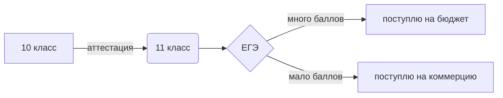

# snake-overlord.github.io

моя персональная страница

sql.py - база данных sql

python шпора.ipynb - шпаргалка по питону

команды sql - список команд и логических операторов sql

9.py - задание 9 демо егэ 2023

v.py - викторина

схема подготовки к егэ:
https://lucid.app/lucidspark/3334163c-8f0f-4340-8b31-a08911cb6baf/edit?viewport_loc=-1558%2C-214%2C4514%2C2050%2C0_0&invitationId=inv_bfb995ed-9e96-4a45-87fe-4fec7cc0b92c

$$ \overline{E}^2_1=\sqrt{\frac{Fa^{x-1}}{(x-1)\cdot x}}+\alpha^{\frac{1}{2}}_1+\beta^{\frac{2}{3}}_2 $$

$$ \mathrm{C}_{m}^{n}=\frac{n!}{m!(n-m)!} $$

$$ \text{cos}\alpha - \text{cos}\beta = -2\text{sin}\frac{\alpha+\beta}{2}\cdot \text{sin}\frac{\alpha-\beta}{2} $$

